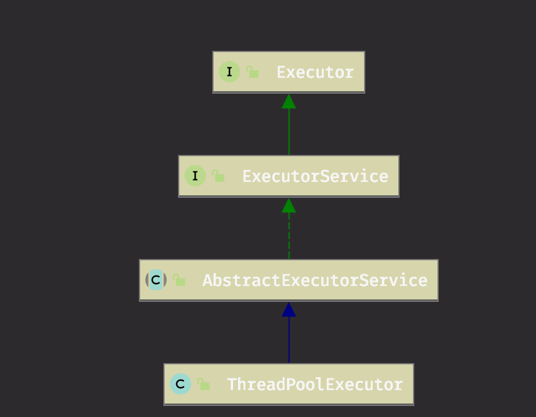

# 线程池
1）什么是线程池
基于池化思想管理线程的工具，引入了之后有以下好处：
* 降低资源消耗：重复利用已经创建的线程，减少了创建和销毁线程的成本
* 提高响应速度：请求来了直接取，不需要等待创建线程
* 提供可管理型：统一调度，监控和调优
* 可扩展性：扩展功能

2）解决了什么问题
* 资源管理问题
* 避免了创建和销毁线程的开销
* 对资源的申请有了限制，避免资源耗尽

下面基于Java的线程池实现进行学习，下面给出了Java中ThreadPoolExecutor的实现UML：



### 1 Executor

**Executor**是一个可以执行提交的任务【*Runnable*】的对象。这个接口提供了一种解耦合【任务提交】和【任务怎样执行】的方式，包括线程的使用以及调度等。Executor通常会取代显式的线程创建。例如，比起使用`new Thread(new(RunnableTask())).start()}`，下面这种方式更好：
```java
    Executor executor = anExecutor;
    executor.execute(new RunnableTask1());
    executor.execute(new RunnableTask2());
```

**Executor**不严格要求任务的执行是异步的，最简单情况下，可以直接在调用者的线程中执行任务，例如
```java
class DirectExecutor implements Executor {
    public void execute(Runnable r) {
        r.run();
    }
}
```

更加常见的是，任务在当前线程以外的线程执行。下面的**Executor**为每个任务都启动了一个线程。

```java
 class ThreadPerTaskExecutor implements Executor {
   public void execute(Runnable r) {
     new Thread(r).start();
   }
 }
```

很多**Executor**的实现添加了一些任务怎么以及何时被调度的限制。下面的这个**Executor**将任务的提交串行提交给第二个**Executor**。

```java
  class SerialExecutor implements Executor {
      final Queue<Runnable> tasks = new ArrayDeque<Runnable>();

      final Executor executor;

      Runnable active;

      SerialExecutor(Executor executor) {
          this.executor = executor;
      }

      public synchronized void execute(final Runnable r) {
          tasks.offer(new Runnable() {
              public void run() {
                  try {
                      r.run();
                  }
                  finally {
                      scheduleNext();
                  }
              }
          });
          if (active == null) {
              scheduleNext();
          }
      }
      
    protected synchronized void scheduleNext() {
        if ((active = tasks.poll()) != null) {
            executor.execute(active);
        }
    }
  }
```

### 2 ExecutorService


**ExecutorService**继承了**Executor**,提供了终止**Executor**的方法以及用于追溯异步任务产生Future结果的方法。
